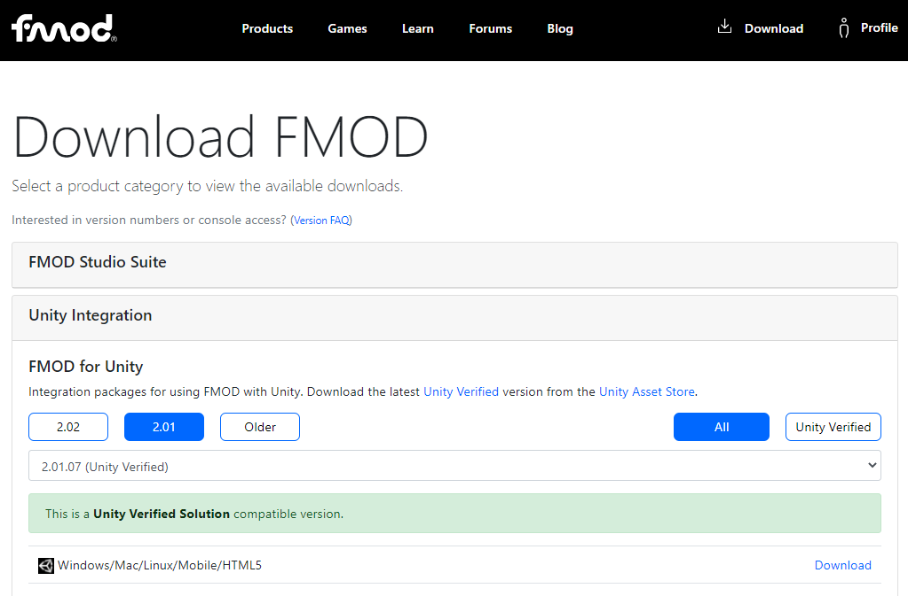

# Tutorial de Integración de Fmod con Unity

El siguiente tutorial muestra un paso a paso para integrar el middleware FMOD studio con Unity 3D

## 1. Descargar el integrador de Fmod para Unity

Ingresar a la seccion de descargas en la pagina oficial de FMOD studio:

[FmodUnityIntegrator Download](https://www.fmod.com/download)

_Nota_: para poder acceder a la opción de descargas deberá hacer un registro de usuario previamente en la pagina de FMOD.

Seleccionamos la opción "Unity integration", luego se desplegara un menú para elegir la version de Fmod para unity,  verifique que la versión elegida corresponda a la versión de FMOD studio que tiene previamente instalada en su equipo.

puede verificar la versión de fmod studio abriendo el programa y dando click en el menú help/ about FMOD Studio, se desplegara una ventana con la información de la versión, para este ejemplo  la versión es 2.01.07

.png)

Se recomienda usar las versiones marcadas como (unity verified) para garantizar compatibilidad.

Luego de la descarga, obtendra el archivo:  fmodstudio20107.unitypackage,  este contiene todos los elementos que requiere unity para comunicarse con fmod studio.

## 2. Crear un proyecto nuevo en Unity

Para integrar fmod en unity debemos tener un proyecto previamente configurado en unity
para este ejemplo crearemos un proyecto nuevo de tipo 3D  llamado "demogame":

.png)

Una vez creado el proyecto se deberá ver de la siguiente manera,  aunque es una escena de ejemplo vacía, nos servirá para realizar la integración y probar que todo funcione correctamente.

.png)

## 2. Importando el integrador de FMOD en Unity

Nos dirigimos a la carpeta assets, damos clic derecho y luego en la Opcion import Package / Custom Package

.png)

Se abrira el navegador para bucar el archivo integrador que descargamos previamente,  lo seleccionamos y damos clic en abrir.

.png)

Posteriormente se abrirá la siguiente ventana donde verificamos que todos los elementos se encuentren seleccionados;  si no es así, podemos presionar el boton "All" para seleccionar todo y luego damos clic en import.

.png)

Se crearan unas carpetas nuevas dentro de assets que contienen los plugins y elementos necesarios para realizar la integracion.   Si todo salió correctamente, notara  que en la parte superior de unity  aparecerá un nuevo menú llamado FMOD.

.png)

_Nota_:  en la parte inferior saldrá un mensaje de error indicando que el proyecto de fmod no ha sido seteado, esto se debe a que aun no hemos creado un proyecto de Fmod Studio para vincularlo a unity.

## 2. Creando un proyecto nuevo en FMOD Studio

Procedemos a crear un proyecto de nuevo de Fmod Studio, asignamos el nombre que queramos, por facilidad lo llamaremos igual que el proyecto de Unity agregando al final la palabra FMOD, lo podemos guardar en cualquier lugar, sin embargo es recomendable guardarlo en la carpeta principal del proyecto de Unity al cual lo vamos a vincular, de esta forma quedara todo ordenado en un mismo lugar.

.png)

Ahora nos dirigimos a Unity, damos clic en el menu FMOD / Edit Settings

.png)

En la pestaña del inspector se abrira un panel para seleccionar el proyecto de fmod que hemos creado, entonces damos clic en browse y buscamos el archivo "demogame.fspro" para vincular la sesion.

.png)

Seguirá apareciendo una alerta indicando que la sesión vinculada no contiene ningún banco sonoro, esto es porque no hemos creado ningún evento sonoro aun, para hacerlo, volvemos a la sesión de FMOD Studio y creamos un nuevo evento de tipo New 2D Timeline

.png)

A continuacion seleccionamos el nuevo evento creado y lo renombramos como queramos, en este caso lo hemos llamado _test_.   

Importamos un audio file de prueba y lo ubicamos en el primer track por medio de un single instrument, tambien añadimos una region de loop dando clic derecho en la banda de logic tracks / Add Loop Region y la ajustamos para que coincida con la region que vamos a colocar en modo loop.

.png)

Note que el evento Test tiene una etiqueta "unnasigned", lo que indica que aun no se a asignado a ningun banco sonoro.

Procedemos a asignar el evento al master bank dando clic derecho sobre el nombre Test y luego en la opcion Asign to Bank / Browse / Master

.png)

Luego de asignarlo, deberá desaparecer la etiqueta "unnasigned", ahora procedemos a construir el banco sonoro dando clic en la pestaña Banks, luego clic derecho sobre el bando Master y por ultimo seleccionando la opcion Build.   Tambien podemos abreviar este proceso con el shortcut F7 o accediendo desde el menu File / build.

.png)

Una vez se ha construido el banco sonoro,  podemos dirigirnos a Unity y verificar que los mensajes de alerta hayan desaparecido.

## 3. Testeando la integración de FMOD

Ahora para testear que la integracion es correcta, nos dirigimos al menu Edit / Project Settings,   en la ventana que se despliega marcamos la opcion "Dissable Unity Audio",   esto con el fin de desabilitar el motor de audio de unity, ya que ahora vamos a trabajar con el motor de audio de  FMOD Studio.

.png)

Ahora nos dirigimos a la ventana de jerarquia y seleccionamos el objeto Main Camera, en la vista del inspector buscamos el componente "Audio Listener" y lo removemos.

.png)

Ahora en creamos un nuevo componente dando clic en el boton add Component / FMOD Studio / FMOD Studio Listener
Este componente reemplaza el audio listener de Unity, solo se agrega una sola vez y generalmente se coloca en la camara principal de la escena.

.png)

Repetimos el mismo proceso para añadir un componente de tipo FMOD Studio Event Emitter que hara las veces de audio source para los eventos que diseñamos en FMOD Studio.  Nos deben quedar ambos componentes de la siguiente forma:

.png)

Configuramos el componente FMOD Studio Event Emitter para reproducir el evento Test, para esto damos clic en la lupa ubicada en el campo Event y buscamos el evento dentro de la carpeta Event Test

.png)

En los campos Play Event y Stop Event, seleccionamos las opciones Object Start y Object Destroy respectivamente, esto para indicarle a unity que el evento se reproducira al crearse el objeto camara y dejara de reproducir al destruirse.    La configuracion debe quedar como se observa a continaucion:

.png)

Por ultimo ejecutamos la escena dando clic en el boton play, si todo se configuro correctamente debemos escuchar el evento sonoro en loop hasta que detengamos la escena y debemos observar en la pantalla game un recuadro llamado "FMOD Studio Debug" donde podemos validar que unity esta ejecutando el motor de audio de FMOD y además podemos monitorear en tiempo real el consumo de cpu, memoria, uso de canales y nivel RMS de nuestro audio.

.png)

_Nota:_ Esta integración se debe realizar cada vez que vamos a sonorizar un proyecto de Unity con FMOD,  a partir de este punto podemos crear todos los eventos que requiera el juego en Fmod Studio, teniendo en cuenta que debemos asignarlos al master bank y volver a construir el banco sonoro F7, cada vez que creemos un nuevo evento o modifiquemos algo para que se actualicen dichos cambios  en Unity .
