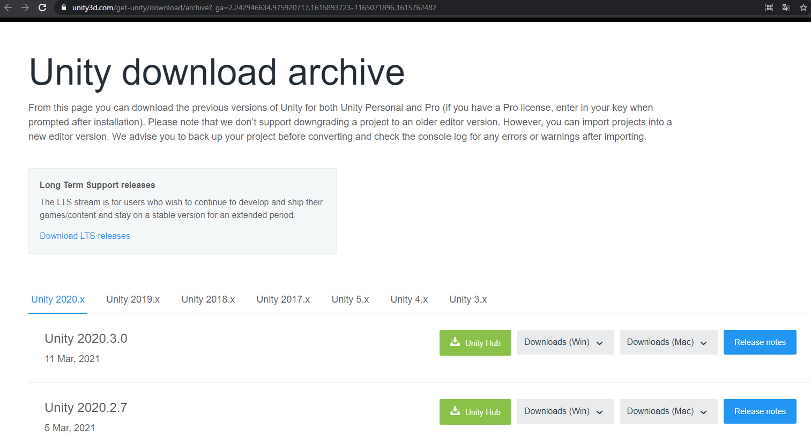

# Tutorial de instalación Unity 2020

El siguiente tutorial muestra un paso a paso para instalar unity 3D en windows.

## 1. Descargar Unity

Ingresar a la pagina de descarga de Unity a través del siguiente enlace:

[Unity All Version Download](https://unity3d.com/get-unity/download/archive?_ga=2.242946634.975920717.1615893723-1165071896.1615762482)

Acá encontrara todas las versiones disponibles de Unity, se recomienda instalar una versión superior a Unity 2018x, tenga en cuenta los requerimientos técnicos de cada versión que podrá consultar en el botón azul "release notes" .

Para este ejemplo hemos seleccionado la ultima versión disponible a la fecha:  "Unity 2020.3.0"

Tenemos varias opciones de descarga, seleccionamos la plataforma para la cual vamos a realizar la instalación, en este caso (Win) y luego damos clic en Unity Installer.

Se descargara automáticamente un archivo "UnityDownloadAssistant-2020.3.0f1.exe"  el cual es un asistente que debemos ejecutar para realizar la instalación.

## 2. Ejecutar instalador

.png)

A continuación solo debe seguir los pasos de instalación dando clic en next.
Se pedirá que acepte los términos de la licencia marcando la casilla de verificación

.png)

En la siguiente ventana deberá seleccionar Unity, los demás ítems son opcionales.

.png)

Tenga en cuenta que la instalación de Unity requiere buen espacio en su disco duro,  para la versión de este tutorial se requieren al menos 5GB de espacio libre en le disco.

.png)

A continuación empezara la descarga, tenga en cuenta que por el peso del programa esto puede tardar un tiempo considerable dependiendo de su equipo y su conexión a internet:

.png)

Una vez finalizada la instalación nos mostrara la siguiente ventana en la cual damos clic en el botón fihish

.png)

## 3. Instalación de unityHub

Luego al lanzar el programa nos pedirá instalar el complemento "Unity Hub" para activar la licencia, recordemos que Unity es un software gratuito para uso no comercial, sin embargo debemos regístranos y activar una licencia personal para acceder a todas sus caracteristicas.  

.png)

Al dar clic en el botón “Install", nos llevara a la pagina web para descargar Unity Hub

.png)

seleccionarmos descargar UnityHub

.png)

Aceptamos el acuerdo de licencia

.png)

Luego damos clic en instalar y cuando complete nos mostrara la siguiente ventana

.png)

Damos clic en terminar verificando que la opción "Ejecutando Unity Hub" este activada,  esto nos lanzara la aplicación, puede que nos aparezca una alerta de seguridad de windows a la cual damos clic en el botón permitir acceso.

.png)

## 4. Login con perfil de usuario

Luego debemos logearnos dando clic en el botón de perfil, sign in.    Si tenemos un registro previo en la pagina de Unity solo debemos ingresar nuestro email y password, sino podemos crear una cuenta nueva dando clic en la opción "create one" o autenticarnos con redes sociales.

.png)

Al crear un nuevo usuario diligenciamos un correo electrónico valido, password, nombre de usuario y nombre completo.  aceptamos los términos del servicio y damos clic en crear Unity ID

.png)

Al correo ingresado se enviara un link de confirmación como se observa en la siguiente imagen,

.png)

Luego de confirmar el correo, podemos dar clic en el botón "continue”.

.png)

Podemos observar que ahora estamos logeados en unity Hub con nuestro correo.

.png)

## 5. Validar licencia

En la parte inferior aun aparece que no tenemos una licencia valida, para lo cual debemos dar clic en la opción MANAGE LICENSE.

.png)

luego damos clic en activar nueva licencia, marcamos las siguientes opciones de licencia para uso personal y damos clic en el botón Done

.png)

De esta forma obtenemos una licencia gratuita que nos da acceso a todas las características de Unity

.png)

## 6. Iniciando Unity

7. Luego para iniciar Unity regresamos al menú principal dando clic en la flecha de preferencias
Damos clic en el botón New para crear un nuevo proyecto, se desplegara la siguiente ventana donde debemos ingresar el nombre del proyecto que puede ser cualquier nombre, seleccionamos una ubicación donde quedara guardado y en template, el tipo de proyecto a crear, en este caso 3D.

.png)

Esperamos a que Unity cree los elementos necesarios para construir el proyecto:

.png)

Finalmente tenemos el proyecto creado listo para importar nuestros "assets" y ejecutar nuestros proyectos de videojuegos:

.png)

